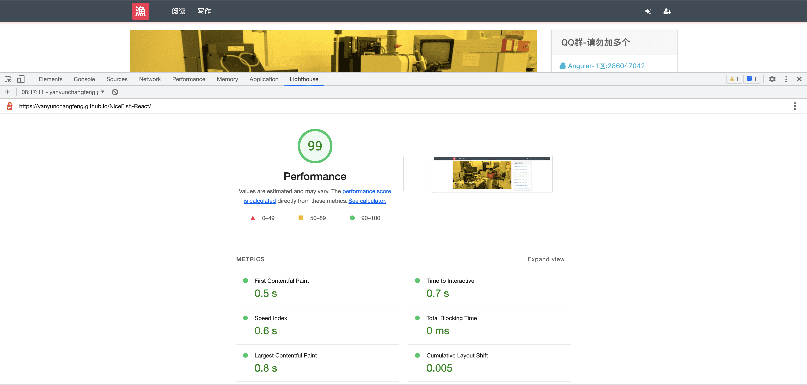

[简体中文](README.md) |  English  

<p align="center">
    
</p>

<h1 align="center">NiceFish</h1>

<div align="left">
NiceFish (Mermaid) is a series of projects, the goal is to demonstrate the development mode of front-end separation, front-end browser, mobile, various development modes in the Electron environment, there are two versions of the back-end: SpringBoot version and SpringCloud version.
</div>


## Installation
Open your command line terminal and execute the following command:

```
   git clone https://gitee.com/mumu-osc/NiceFish-React.git
   cd NiceFish-React
   yarn or npm i
   yarn start or npm start
```  

## Instructions

This project is a React version of NiceFish, using React version 18.2.0, developed using  the Ant Design component library,the inversify library and Bootstrap v4.2.1.

## Online demo


- NiceFish-React Demo address on GitHub Pages: https://damoqiongqiu.github.io/NiceFish-React  

## Technology Architecture


## Main Dependency  
- React 18.2.0
- antd 5.6.2
- Bootstrap 4.2.1
- echarts 4.2.1
- braft-editor 2.2.9

## Series project

*  NiceFish: This is a series of projects whose goal is to demonstrate the development mode of front-end and back-end separation: various development modes in front-end browsers, mobile terminals, and Electron environments. There are two versions of the backend: SpringBoot version and SpringCloud version  http://gitee.com/mumu-osc/NiceFish/ 
*  NiceFish-React: This is the implementation of the React version 18.2.0, developed using Ant Design component library, inversify library, and Bootstrap version 4.2.1 .
*  NiceBlogElectron: https://github.com/damoqiongqiu/NiceBlogElectron, an Electron-based desktop project that packages NiceFish with Electron as a desktop-running program. This is provided by the front-end friends of ZTE . I have a fork and there are several version numbers of the node module. If you are researching how to use Electron to develop desktop applications, please refer to this project.


## Unit Test

```
   yarn test or npm run test
```
## e2e Test

```
    yarn cypress:open or  npm run cypress:open
    yarn cypress:run or  npm run cypress:run
```
## Bundle Analyzer

```
   yarn build-analyzer or npm run build-analyzer  
```

## Analysis Report


## Associated QQ group

<a target="_blank" href="//shang.qq.com/wpa/qunwpa?idkey=cbf15a3d8f212076a8de5b6fa4b5a16d750cc5d7f2d55b14ad0ea8bcb6fd976e" class="list-group-item"><i class="fa fa-qq" aria-hidden="true"></i> React Family photo-1 :701149807 </a>

## Open source license

MIT